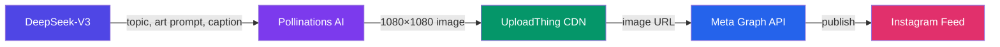

<div align="center">

# 🤖 InstaAuto AI

**AI-powered Instagram automation — generate and publish coding memes daily**

[](https://nextjs.org/)
[](https://www.typescriptlang.org/)
[](https://tailwindcss.com/)
[](https://www.prisma.io/)
[](https://neon.tech/)
[](https://developers.facebook.com/)

---

<p align="center">
  <b>Full Dashboard</b> ·
  <a href="#quick-start">Quick Start</a> ·
  <a href="#deployment">Deployment</a> ·
  <a href="./CREDENTIALS.md">Credentials</a> ·
  <a href="./SETUP.md">Setup Guide</a>
</p>

</div>

---

## 📋 Table of Contents

- [Overview](#-overview)
- [Architecture](#-architecture)
- [Features](#-features)
- [Tech Stack](#-tech-stack)
- [Pages](#-pages)
- [Quick Start](#-quick-start)
- [API Routes](#-api-routes)
- [Deployment](#-deployment)
- [Environment Variables](#-environment-variables)
- [License](#-license)

---

## 🚀 Overview

InstaAuto AI is a fully autonomous pipeline that:
1. **Generates** a coding meme topic using DeepSeek-V3
2. **Creates** a visual with Pollinations AI (1080×1080, comic style)
3. **Hosts** the image on UploadThing CDN
4. **Publishes** to Instagram via the Meta Graph API
5. **Repeats** daily at your configured schedule hour

All managed through a beautiful bento-grid dashboard.

---

## 🔧 Architecture



<details>
<summary><b>📊 Pipeline Flow (detailed)</b></summary>

```
┌─────────────────────────────────────────────────────────────────┐
│                    Cron Trigger (daily)                          │
│    POST /api/cron/worker  ›  Authorization: Bearer {SECRET}     │
└─────────────────────────────────────────────────────────────────┘
                              │
                              ▼
┌─────────────────────────────────────────────────────────────────┐
│  ① DeepSeek-V3 (via Hugging Face router)                        │
│     ├─ generateTopic()    → "Me: writes perfect code..."        │
│     ├─ generateArtPrompt()→ "cartoon comic style..."            │
│     └─ generateCaption()  → funny relatable caption + hashtags  │
└─────────────────────────────────────────────────────────────────┘
                              │
                              ▼
┌─────────────────────────────────────────────────────────────────┐
│  ② Pollinations AI                                              │
│     └─ buildPollinationsUrl() → 1080×1080 image                 │
│        (30-60s generation time, no text in image)               │
└─────────────────────────────────────────────────────────────────┘
                              │
                              ▼
┌─────────────────────────────────────────────────────────────────┐
│  ③ UploadThing CDN                                              │
│     └─ uploadImageFromUrl() → permanent CDN URL                 │
└─────────────────────────────────────────────────────────────────┘
                              │
                              ▼
┌─────────────────────────────────────────────────────────────────┐
│  ④ Meta Graph API v22.0                                         │
│     ├─ createMediaContainer() → media container ID              │
│     ├─ wait 60s (for processing)                                │
│     └─ publishMediaContainer() → post published on Instagram    │
└─────────────────────────────────────────────────────────────────┘
```
</details>

---

## ✨ Features

| Feature | Description |
|---------|-------------|
| 🧠 **AI Content Generation** | DeepSeek-V3 generates meme topics, art prompts, and captions |
| 🎨 **AI Image Generation** | Pollinations AI creates 1080×1080 comic-style visuals (no text overlay) |
| ☁️ **Image Hosting** | UploadThing CDN stores generated images with permanent URLs |
| ⏰ **Scheduled Publishing** | Daily posts at your configured hour via Meta Graph API |
| 📊 **Bento Dashboard** | Stats cards, recent posts, gallery, activity log, settings |
| 🖼️ **Post Gallery** | `/posts` — full gallery with image previews and lightbox |
| 🎭 **Coding Memes** | Relatable programmer humor — fully configurable topic |
| 🔐 **No OAuth** | Direct Page Access Token — works with unpublished Meta apps |
| 🐳 **Self-hosted** | Runs anywhere — VPS, Raspberry Pi, cloud VM |

---

## 🛠️ Tech Stack

| Layer | Technology | Badge |
|-------|-----------|-------|
| Framework | **Next.js 15** (App Router) |  |
| Language | **TypeScript** |  |
| Styling | **Tailwind CSS v4** |  |
| Database | **PostgreSQL** (Neon.tech) |  |
| ORM | **Prisma** |  |
| AI | **DeepSeek-V3** (Hugging Face) |  |
| Image Gen | **Pollinations AI** |  |
| Image CDN | **UploadThing** |  |
| API | **Meta Graph API v22.0** |  |
| Auth | **Direct Page Access Token** |  |

---

## 📄 Pages

| Route | Description | Screenshot |
|-------|-------------|------------|
| `/` | Landing page with hero, features, CTA | 🏠 |
| `/dashboard` | Stats overview, account info, recent posts, gallery | 📊 |
| `/posts` | Full gallery grid with lightbox viewer | 🖼️ |
| `/logs` | Activity log — status badges, errors, timestamps | 📝 |
| `/settings` | Automation controls — topic, schedule, toggle | ⚙️ |

---

## ⚡ Quick Start

### Prerequisites

| Requirement | Version |
|-------------|---------|
| Node.js | ≥ 18 LTS |
| PostgreSQL | 14+ (Neon.tech free tier recommended) |
| npm | 9+ |

### Installation

```bash
# 1. Clone
git clone https://github.com/I-SHOW-AKIRU200/instaauto-ai.git
cd instaauto-ai

# 2. Install
npm install

# 3. Configure env
cp .env.example .env
# → Fill in all values (see CREDENTIALS.md)

# 4. Push database schema
npx prisma db push

# 5. Seed Instagram config
npm run seed

# 6. Build & start
npm run build
npm start -p 3000
```

> **Visit:** [`http://localhost:3000/dashboard`](http://localhost:3000/dashboard)

---

## 🌐 API Routes

| Method | Route | Auth | Description |
|--------|-------|------|-------------|
| `GET` | `/api/config` | — | Fetch Instagram config + 20 recent logs |
| `POST` | `/api/config` | — | Update prompt settings, schedule, active state |
| `GET` | `/api/cron/worker` | `Bearer {CRON_SECRET}` | Trigger the full generation → publish pipeline |
| `POST` | `/api/cron/worker` | `Bearer {CRON_SECRET}` | Same as GET |

---

## 🚢 Deployment

### Production Server

```bash
npm run build
npm start -p 3000 --hostname 0.0.0.0
```

### Systemd Service

```ini
[Unit]
Description=InstaAuto AI
After=network.target

[Service]
Type=simple
User=youruser
WorkingDirectory=/path/to/instauto-ai
ExecStart=/usr/bin/npm start -- -p 3000
Restart=always
Environment=NODE_ENV=production

[Install]
WantedBy=multi-user.target
```

```bash
sudo cp instauto-ai.service /etc/systemd/system/
sudo systemctl enable --now instauto-ai
```

### Cron Job

Set up daily publishing via crontab:

```bash
crontab -e
```

```cron
# Run daily at 07:00 UTC → 10:00 UTC+3
0 7 * * * curl -s -X POST http://localhost:3000/api/cron/worker \
  -H "Authorization: Bearer YOUR_CRON_SECRET" \
  -H "Content-Type: application/json"
```

### Cloudflare Tunnel (HTTPS)

```bash
npx cloudflared tunnel --url http://localhost:3000
```

Update `NEXT_PUBLIC_APP_URL` with the tunnel URL.

---

## 🔐 Environment Variables

| Variable | Status | Description |
|----------|--------|-------------|
| `DATABASE_URL` | ✅ Required | PostgreSQL connection string (Neon.tech) |
| `NEXT_PUBLIC_APP_URL` | ✅ Required | Public URL (local or tunnel) |
| `META_APP_ID` | ✅ Required | Facebook App ID |
| `META_APP_SECRET` | ✅ Required | Facebook App Secret |
| `HF_API_TOKEN` | ✅ Required | Hugging Face API token (`hf_...`) |
| `CRON_SECRET` | ✅ Required | Random hex string for cron auth |
| `UPLOADTHING_TOKEN` | ✅ Required | UploadThing API token |

> 📖 **See [`CREDENTIALS.md`](./CREDENTIALS.md)** for step-by-step instructions on obtaining each credential.

---

## 📂 Project Structure

```
instauto-ai/
├── prisma/
│   ├── schema.prisma          # Database models
│   └── seed.ts                # Instagram config seeder
├── scripts/
│   ├── startup.sh             # Interactive deployment (systemd + crontab)
│   ├── check_logs.mjs         # Debug: view post logs
│   ├── clear_logs.mjs         # Debug: clear failed logs
│   └── test_upload.mjs        # Debug: test UploadThing
├── src/
│   ├── app/
│   │   ├── page.tsx           # Landing page
│   │   ├── layout.tsx         # Root layout
│   │   ├── globals.css        # Tailwind + glassmorphism
│   │   ├── dashboard/         # Dashboard page
│   │   ├── posts/             # Gallery page
│   │   ├── logs/              # Activity log page
│   │   ├── settings/          # Settings page
│   │   └── api/
│   │       ├── config/        # Config API route
│   │       ├── cron/worker/   # Pipeline route
│   │       └── auth/instagram/# OAuth routes (unused)
│   ├── components/
│   │   ├── Sidebar.tsx        # Navigation sidebar
│   │   └── icons/             # Inline SVG icons (11)
│   └── lib/
│       ├── deepseek.ts        # DeepSeek-V3 generation
│       ├── meta.ts            # Meta Graph API helpers
│       ├── pollinations.ts    # Pollinations URL builder
│       ├── uploadthing.ts     # UploadThing upload
│       └── types.ts           # TypeScript types
├── opencode.json              # OpenCode MCP config
├── .env.example               # Environment template
├── AGENTS.md                  # AI agent instructions
├── CLAUDE.md                  # Claude Code context
├── CREDENTIALS.md             # How to get env vars
├── SETUP.md                   # Detailed setup guide
└── README.md                  # This file
```

---

## 🤝 Contributing

1. Fork the repo
2. Create a feature branch (`git checkout -b feature/amazing`)
3. Commit (`git commit -m 'Add amazing feature'`)
4. Push (`git push origin feature/amazing`)
5. Open a Pull Request

---

## 📄 License

Distributed under the **MIT License**. See [`LICENSE`](./LICENSE) for more information.

---

<div align="center">

**Built with ❤️ by [I-SHOW-AKIRU200](https://github.com/I-SHOW-AKIRU200)**

</div>
